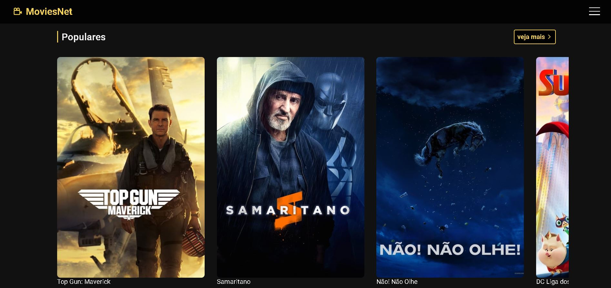

# Movies Net

<!---Esses são exemplos. Veja https://shields.io para outras pessoas ou para personalizar este conjunto de escudos. Você pode querer incluir dependências, status do projeto e informações de licença aqui--->

> Website criado para busca de filmes e recomendações.
 
Todas as informações contidas foram retiradas da <a href="https://developers.themoviedb.org/3"> TMDB Api.</a>
 

 

<h4 align="center"><a href="https://movies-net-project.netlify.app/" target="_blank">Clique para visitar o projeto</a></h4>

## 📚 Seções

O site é composto por quatro seções:

- **Home:** Nele temos uma lista de melhores filmes;
- **Recomendados:** Apresenta uma lista dos filmes mais votados da semana;
- **Lançamentos:** Contém uma lista dos filmes recém lançados ou em processo de lançamento;
- **Filme:** Nesta rota temos informações sobre o filme escolhido;

---
 

## 🚀  Funcionalidades

O projeto visou o aprendizado e a criação de um website a partir de tais tecnologias:

- React;
- Redux;
- JavaScript;
- Html;
- Css;
- Api Externa ( TMDB );
- React-Router-Dom;
- React-icons ( Biblioteca )

---

### Ajustes e melhorias

O projeto foi concluído e todas as tarefas finalizadas:

- [x] Tarefa 1
- [x] Tarefa 2
- [x] Tarefa 3
- [x] Tarefa 4
- [x] Tarefa 5

* Compatível `<Windows / Linux / Mac>`."

 

